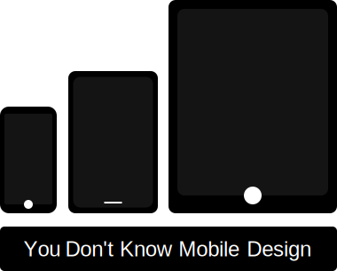

   
  <h3>Your Ultimate Guide To Better Mobile User Interfaces.</h3> 

---

## :muscle: Motivation

Inspired by the title of [KYLE SIMPSON](https://github.com/getify)'s book [You Don't Know JS](https://github.com/getify/You-Dont-Know-JS), I created [You Don't Know UI](https://github.com/You-Dont-Know-UI) which is a collection of detailed pro tips about designing and developing modern user interfaces for the web.

Back to 2017, I started to spend my spare time to learn in-depth about Web Design, Mobile Design, Animation, Micro-Interaction, User Experience and Design Systems by reading several books and articles such as [Refactoring UI](https://refactoringui.com/) by [Adam Wathan](https://github.com/adamwathan) & [Steve Shoger](https://www.steveschoger.com/), [Invision Design System Handbook](https://www.designbetter.co/design-systems-handbook), [Atomic Design](https://bradfrost.com/blog/post/atomic-web-design/) by [Brad Frod](https://github.com/bradfrost), [Airbnb Design System](https://github.com/airbnb), asking questions on [User Experience Platform](https://ux.stackexchange.com/), and sharing my personal [prototypes](https://www.behance.net/menaialaeddine) on Behance.

Though I've never wrote a code for mobile applications ( Android & iOS ), I was an enthusiast with the mobile design.
Because I'm a React Developer, I started learning React Native few months ago and I've noticed that **React developers don't have time to learn the mobile design from scratch** which prevent them from developing universal, seamless and beautiful apps. For that reason, I created [You Don't Know Mobile Design](https://github.com/You-Dont-Know-Mobile-Design) which is a collection of detailed pro tips about designing modern user interfaces for mobile application.

.

---

## :bouquet: Value

From basic to advanced: learn how to design better mobile UI, test how well your current mobile UI, feed your knowledge a bit, or recommend this guide to your teammate. :muscle: :rocket: I update this repo regularly with new PRO TIPS. I added illustrations to make the explanations more tangible. good luck! :heart:

